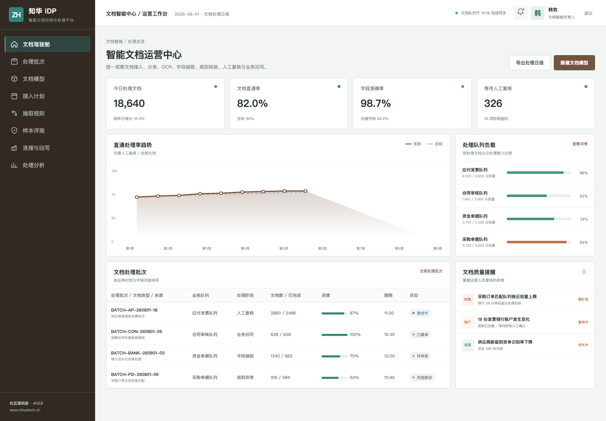
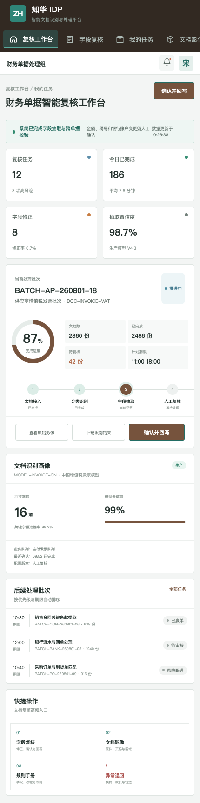

# ZhuaTech IDP｜知华科技智能文档识别与处理平台

> 把发票、合同、回单、订单和各类扫描件转化为经过校验、可以直接进入业务系统的数据。

由知华科技（上海如静知华信息科技有限公司）发布 · [官方网站](https://www.zhuatech.cn/) · [部署文档](deploy/README.md)

## 处理中心



管理端关注处理量、直通率、识别准确率、队列容量与模型漂移。不同文档模型拥有独立字段、版面、校验规则和业务回写映射。

## 人工复核



复核人员可以对照原始影像和识别区域，确认金额、税号、账户等关键字段；每一次修正都留下审计记录，并可沉淀为后续模型优化样本。

## 文档自动化管线

```text
上传/邮箱/扫描/API → 文档分类 → OCR 与版面理解 → 字段/表格抽取
                    → 规则与跨单据校验 → 人工复核 → ERP/财务/合同系统回写
```

支持的社区版能力包括文档批次、模型目录、字段抽取配置、规则校验、人工复核、异常退回、评测报告和运营分析。模型接入采用抽象 Provider，公开仓库不会保存云 OCR 或大模型密钥。

## 文档质量门禁

OCR 结果进入业务系统前会经过字段完整性、签章存在性、表格识别置信度和整体 OCR 置信度检查。接口返回 `PASS`、`MANUAL_REVIEW` 或 `REJECT`，并列出缺失字段和后续动作，使自动抽取与人工复核边界清晰可追踪。

## 技术基线

Java 21、Spring Boot、Spring Security、JWT、JPA、Flyway、Vue 3、Pinia、Vite、MySQL 8、H2 Test、Docker Compose 与 Nginx。包名为 `cn.zhuatech.idp`，默认数据库为 `zhuatech_idp`。

```bash
cd frontend && npm install && npm run dev:demo
```

管理端使用 `planner / Demo@2026`，复核端使用 `operator / Demo@2026`。演示文档、供应商、金额和人员均为虚构数据。

## 授权与合作

本工程仅允许个人学习、研究和非商业交流，禁止商业使用。生产部署、企业内部使用、SaaS、项目交付、收费服务、品牌替换和商业再分发须取得上海如静知华信息科技有限公司书面授权，完整条款见 [LICENSE](LICENSE)。

智能文档、OCR、合同抽取、财务自动化、私有化部署和深度定制，请访问[知华科技官网](https://www.zhuatech.cn/)或扫码沟通：

| 微信一 | 微信二 |
| --- | --- |
|  |  |

SEO：IDP 系统源码、智能文档处理、OCR 平台、发票识别、合同抽取、文档 AI、Java IDP、知华科技。
